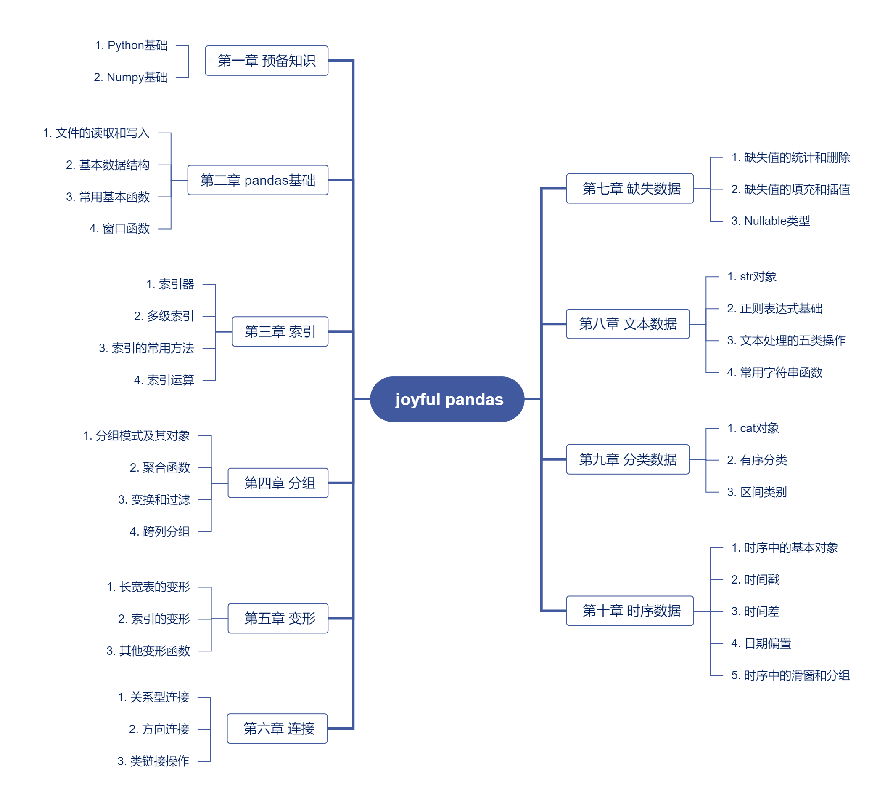

## Pandas Learning
Datawhale joyful-pandas: [joyful-pandas(熊猫书)](https://github.com/datawhalechina/joyful-pandas)
#### Tutorial Introduction：


---

## Seaborn Learning
CSDN Seaborn Tutorial: [seaborn 使用指南（超详细！）](https://blog.csdn.net/weixin_48024605/article/details/136037709)
#### Tutorial Introduction：
| 类别                  | 描述                                                                                       | 示例代码                                   |
|-----------------------|--------------------------------------------------------------------------------------------|-------------------------------------------|
| **Seaborn 简介**      | 基于 Matplotlib 的高级数据可视化库，专注于统计图表                                         |                                   |
| **主要特征**          | - 提供美观的默认样式<br>- 支持复杂的数据可视化<br>- 与 Pandas 数据结构无缝集成             |                                   |
| **主要内容**          | 分类图、分布图、关系图、矩阵图等                                                           |                                   |
|-----------------------|--------------------------------------------------------------------------------------------|-------------------------------------------|
| **图表大小：context** | 设置图表的整体大小（`paper`, `notebook`, `talk`, `poster`）                                | `sns.set_context("notebook")`             |
| **设置风格**          | 设置图表的风格（`darkgrid`, `whitegrid`, `dark`, `white`, `ticks`）                        | `sns.set_style("whitegrid")`              |
| **设置字体与支持中文**| 设置字体以支持中文显示                                                                     | `plt.rcParams['font.sans-serif'] = ['SimHei']` |
| **设置临时风格**      | 使用 `with` 语句临时更改风格                                                               | `with sns.axes_style("dark"):`            |
| **设置调色板**        | 设置颜色调色板                                                                             | `sns.set_palette("Set2")`                 |
| **set 方法**          | 综合设置风格、上下文和调色板                                                               | `sns.set(style="whitegrid", palette="muted")` |
|-----------------------|--------------------------------------------------------------------------------------------|-------------------------------------------|
| **分类色板 (Qualitative)** | 用于区分不同类别，颜色差异明显                                                           | `sns.color_palette("Set1")`               |
| **连续调色板**        | 用于表示数值的连续变化，颜色渐变                                                         | `sns.color_palette("Blues")`              |
| **离散调色板**        | 用于离散值的颜色映射                                                                     | `sns.color_palette("Paired")`             |
|-----------------------|--------------------------------------------------------------------------------------------|-------------------------------------------|
| **数据集**            | Seaborn 提供了一些内置数据集，便于快速测试和学习                                          | `sns.load_dataset("tips")`                |
|-----------------------|--------------------------------------------------------------------------------------------|-------------------------------------------|
| **条形图**            | 显示分类变量的平均值或总计                                                                 | `sns.barplot(x="x", y="y", data=data)`    |
| **箱线图**            | 显示数据的分布情况和异常值                                                                 | `sns.boxplot(x="x", y="y", data=data)`    |
| **小提琴图**          | 结合箱线图和密度图，展示数据分布                                                           | `sns.violinplot(x="x", y="y", data=data)` |
| **点图**              | 显示分类变量的点估计和置信区间                                                             | `sns.pointplot(x="x", y="y", data=data)`  |
|-----------------------|--------------------------------------------------------------------------------------------|-------------------------------------------|
| **直方图**            | 显示数据的频率分布                                                                         | `sns.histplot(data, x="x")`               |
| **核密度图**          | 显示数据的概率密度                                                                         | `sns.kdeplot(data, x="x")`                |
| **联合分布图**        | 同时显示两个变量的分布和关系                                                               | `sns.jointplot(x="x", y="y", data=data)`  |
|-----------------------|--------------------------------------------------------------------------------------------|-------------------------------------------|
| **散点图**            | 显示两个变量之间的关系                                                                     | `sns.scatterplot(x="x", y="y", data=data)`|
|-----------------------|--------------------------------------------------------------------------------------------|-------------------------------------------|
| **线性回归图**        | 显示两个变量之间的线性关系                                                                 | `sns.regplot(x="x", y="y", data=data)`    |
|-----------------------|--------------------------------------------------------------------------------------------|-------------------------------------------|
| **catplot**           | 用于绘制分类数据的通用接口                                                                 | `sns.catplot(x="x", y="y", data=data)`    |
| **relplot**           | 用于绘制关系数据的通用接口                                                                 | `sns.relplot(x="x", y="y", data=data)`    |
| **FacetGrid**         | 创建多子图网格，用于展示多个维度的数据                                                     | `g = sns.FacetGrid(data, col="col")`      |
| **PairGrid**          | 创建成对关系图的网格                                                                       | `g = sns.PairGrid(data)`                  |
| **JointGrid**         | 创建联合分布图的网格                                                                       | `g = sns.JointGrid(x="x", y="y", data=data)` |
| **jointplot**         | 快速绘制联合分布图                                                                         | `sns.jointplot(x="x", y="y", data=data)`  |
---

## ydata-profiling Learning
```python
import pandas as pd
from ydata_profiling import ProfileReport

df = pd.read_csv('data.csv')
profile = ProfileReport(df, title="Profiling Report")
profile.to_file("data_analysis_report.html")
```

---

## Data Analysis
My CSDN Data Analysis Tutorial: [数据分析](https://blog.csdn.net/m0_73202283/article/details/133848768)
#### Tutorial Introduction：
数据分析的主要内容包括：

| 类别                  | 描述                                                                                       | 备注                                   |
|-----------------------|--------------------------------------------------------------------------------------------|---------------------------------------|
| 相关统计量            | 包括均值、中位数、标准差等统计量                                                           |                                       |
| 数据类型              | 数据的类型（数值型、分类型、时间序列等）                                                   |                                       |
| 缺失值与异常值        | 检查缺失值和异常值的分布情况                                                               | LightGBM 和 XGBoost 支持缺失值处理    |
| 总体分布状况          | 数据的整体分布特性                                                                         |                                       |
| Skewness (偏度)       | 数据分布的偏斜程度                                                                         | 偏度 > 0 表示右偏，< 0 表示左偏       |
| Kurtosis (峰度)       | 数据分布的尖峰程度                                                                         | 峰度 > 3 表示尖峰，< 3 表示平峰       |
| 预测值的具体频数      | 预测值在不同区间内的分布情况                                                               |                                       |
| 相关性分析            | 特征之间的相关性分析（如皮尔逊相关系数、斯皮尔曼相关系数等）                               |                                       |
| Unique 分布           | 特征值的唯一性分布                                                                         |                                       |
| 小提琴图              | 可视化数据分布及密度                                                                       |                                       |
数据清洗的主要内容包括：

| 类别                  | 描述                                                                                       | 备注                                   |
|-----------------------|--------------------------------------------------------------------------------------------|---------------------------------------|
| 感知压缩补全          | 使用感知算法对数据进行压缩和补全                                                           |                                       |
| 矩阵补全              | 对缺失数据进行矩阵补全                                                                     |                                       |
| 缺失值分箱            | 将缺失值单独作为一个分箱                                                                   |                                       |
| 数据分桶              | 将连续变量离散化为多个区间                                                                 |                                       |
| 等频分桶              | 每个分桶中的样本数量相等                                                                   |                                       |
| 等距分桶              | 每个分桶的区间长度相等                                                                     |                                       |
| Best-KS 分桶          | 根据 KS 统计量选择最优分桶点                                                               |                                       |
| 卡方分桶              | 基于卡方检验选择分桶点                                                                     |                                       |
| 归一化                | 将数据缩放到 [0, 1] 范围                                                                   |                                       |
| 标准化                | 将数据转换为均值为 0，标准差为 1 的分布                                                     |                                       |
| 幂律分布处理          | 对幂律分布的数据进行变换（如对数变换）                                                     |                                       |
特征工程的主要内容包括：

| 类别                  | 描述                                                                                       | 备注                                   |
|-----------------------|--------------------------------------------------------------------------------------------|---------------------------------------|
| 特征构造              | 构造新的特征以提升模型性能                                                                 |                                       |
| 特征选择              | 选择对模型最有用的特征，去除冗余或无关特征                                                 |                                       |
| 降维                 | 使用 PCA、t-SNE 等方法降低特征维度                                                         |                                       |